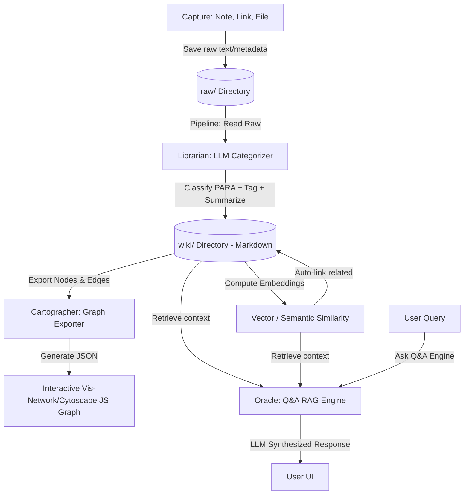

# Architecture Design: SecondSelf (AI Second Brain)

This document outlines the end-to-end architecture, technical stack, directory structure, data flows, and week-by-week implementation plan for **SecondSelf** — a self-organizing, interactive personal AI Second Brain.

---

## 1. System Overview & Data Flow

The system processes incoming knowledge through four distinct phases, turning raw inputs into an interconnected, queryable semantic network:



---

## 2. Technical Stack

* **Language & Runtime:** Python 3.10+
* **Web Framework & UI:** Streamlit (combines UI, Q&A interface, and graph visualization wrapper)
* **LLM Integration:** Groq API / Llama 3 (for fast, free JSON classification and synthesis) or Google Gemini API
* **Embeddings & Similarity:** `sentence-transformers` (e.g., `all-MiniLM-L6-v2` run locally) or OpenAI/Gemini embeddings.
* **Graph Visualization:** Streamlit Components with `vis-network` (or `pyvis` for quick pythonic wrappers)
* **Storage:** File-based markdown with YAML frontmatter for notes; standard JSON for the graph representation.

---

## 3. Directory Structure

```text
second-brain/
├── doc/
│   └── problemStatement.md
├── raw/                         # Raw, incoming captures
│   ├── capture_20260719_120000_1a2b.json
│   └── capture_20260719_120530_3c4d.json
├── wiki/                        # Self-organized notes (Markdown + YAML Frontmatter)
│   ├── Projects/
│   ├── Areas/
│   ├── Resources/
│   └── Archives/
├── src/
│   ├── __init__.py
│   ├── capture.py               # Week 1: CLI & capture logic
│   ├── organize.py              # Week 2: LLM Classifier & PARA generator
│   ├── embed.py                 # Week 2: Embeddings & similarity auto-linker
│   ├── graph.py                 # Week 3: Graph JSON generator & data model
│   └── app.py                   # Week 4: Streamlit UI & RAG ask() implementation
├── requirements.txt             # Project dependencies
└── README.md                    # Setup and usage guide
```

---

## 4. Detailed Component Design (Week-by-Week)

### Week 1 — The Archivist (Capture Pipeline)

* **Purpose:** Provide a bulletproof command-line interface (CLI) to store thoughts, web URLs, or physical files.
* **Output Schema (`raw/*.json`):**

    ```json
    {
      "id": "uuid-v4-or-short-hash",
      "timestamp": "2026-07-19T12:00:00Z",
      "type": "note | link | file",
      "source": "cli-arguments",
      "content": "Raw text content, URL, or file path/extracted text",
      "metadata": {
        "original_filename": "optional.pdf",
        "url": "optional.com"
      }
    }
    ```

### Week 2 — The Librarian (Auto-Classify & Link)

* **LLM Sorting Hat:** Sends the raw content to the LLM with a strict JSON system prompt.

    ```json
    {
      "category": "Projects | Areas | Resources | Archives",
      "tags": ["machine-learning", "productivity"],
      "summary": "One-line summary of the content",
      "clean_title": "Descriptive_Filename_Safe_Title"
    }
    ```

* **File Writer:** Converts the raw JSON + classification into a structured markdown file in `wiki/<Category>/<clean_title>.md` with YAML frontmatter:

    ```markdown
    ---
    id: "uuid-v4"
    title: "Descriptive Title"
    category: "Projects"
    tags: [machine-learning, productivity]
    summary: "One-line summary of the content"
    links: []
    ---
    Raw content or processed text goes here...
    ```

* **Auto-Linker:**
    1. Loads all existing documents in `wiki/`.
    2. Computes sentence-transformer embeddings.
    3. Calculates cosine similarity between the new note and existing notes.
    4. If similarity > `similarity_threshold` (e.g. `0.6`), appends mutual links:
       * Adds `[[related-note-title]]` to the bottom of the markdown content.
       * Updates the YAML `links` list in both documents.

### Week 3 — The Cartographer (Visualizing the Brain)

* **Graph Exporter (`src/graph.py`):** Parses all `.md` files in `wiki/` recursively.
  * **Nodes:** Notes (labeled by title, colored by PARA category, sizing proportional to number of links).
  * **Edges:** Links connecting notes.
* **Output Format (`graph.json`):**

    ```json
    {
      "nodes": [
        {"id": "uuid-1", "label": "ML Study Plan", "group": "Projects", "title": "Summary: Studying ML..."},
        {"id": "uuid-2", "label": "PyTorch Cheat Sheet", "group": "Resources", "title": "Summary: Quick PyTorch reference..."}
      ],
      "edges": [
        {"from": "uuid-1", "to": "uuid-2"}
      ]
    }
    ```

* **Frontend Rendering:** Uses `streamlit-vis-network` or embeds HTML iframe with Vis.js to offer drag, zoom, and interactive hover tooltips (using the note summary).

### Week 4 — The Oracle (Ask Your Brain)

* **Search Engine (`src/app.py`):**
    1. Embeds the user question.
    2. Runs similarity search against the database of note embeddings to retrieve the top $K$ relevant notes.
    3. Passes retrieved note contents as context to the LLM.
    4. Prompt: *"Answer the user's question using ONLY the retrieved note context. Cite source titles."*
* **Streamlit Layout:**
  * **Sidebar:** Capture interface (quick note text entry) + statistics.
  * **Main Page:**
    * **Tab 1 (Explore):** The Interactive 3D/2D Graph showing the self-organizing second brain.
    * **Tab 2 (Ask):** Q&A input bar + LLM-synthesized response with clickable/referenceable source notes.

---

## 5. Verification Plan

* **Integration Tests:** Verify that running `python src/capture.py` followed by `python src/organize.py` correctly updates the `wiki/` structure and recalculates `graph.json`.
* **UI Tests:** Verify Streamlit app renders correctly, interactive graph loads node events, and Q&A returns accurate citations.
